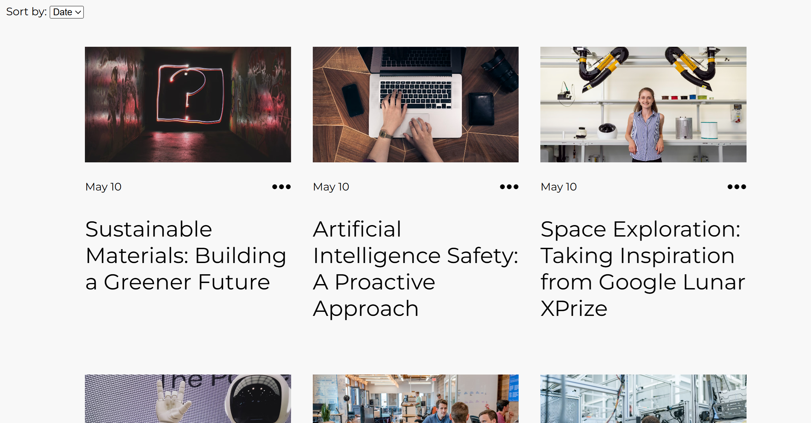

# HotWiew Labs

This is a school project where I created a website using HTML, CSS and JS.




## Description

This is a Blog where all content is fetched using API. I designed the website using FIGMA, then I built it using HTML for structure, CSS for styling and JS for interactivity and fetcing API. I also used Postman for API calls and sending content to the API. Two of the pages are only available when logged in: Edit post and Create post. The possibility to delete posts are also available when logged in. At the Home page you will find a carousel containing the three latest posts, and a grid with sorting function to see the 12 latest posts.

## Site architecture
- Home
- Blogpost public
- Edit post (only if logged in)
- Create post (only if logged in)
- Login
- Register
- About

## Built With

- HTML
- CSS
- JS

## Features

- User-friendly interface
- Responsive design for mobile and desktop
- Login form
- Register form
- Sorting of posts

## Getting Started

### Prerequisites

Ensure you have the following installed:
- npm (Node Package Manager)

### Installing

1. Clone the repository:

```bash
git clone https://github.com/NoroffFEU/FED1-PE1-omro0107.git
```

2. Navigate to the project directory

```bash
cd FED1-PE1-omro0107
```

3. Install the dependencies

```bash
npm install
```

### Running

To run the app, run the following commands:

```bash
npm run start
```

### Usage
After starting the app, open your web browser and go to http://localhost:3000 to view the website.

## Contributing

Contributions are welcome! Please follow these steps:

1. Fork the project.
2. Create a new branch (git checkout -b feature-name).
3. Commit your changes (git commit -m 'Add some feature').
4. Push to the branch (git push origin feature-name).
5. Create a new Pull Request.

## Contact

[My LinkedIn page](https://www.linkedin.com/in/oda-marie-rosenkilde-9b0919287/)

## License

This project is created for educational purposes and is not released under a specific license.

## Acknowledgments

Images from www.unsplash.com